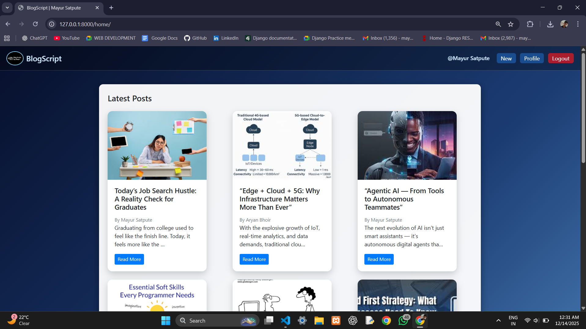
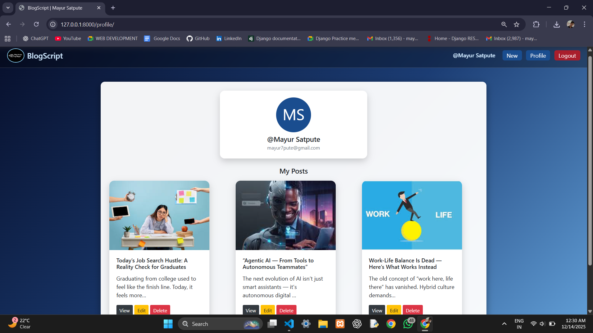
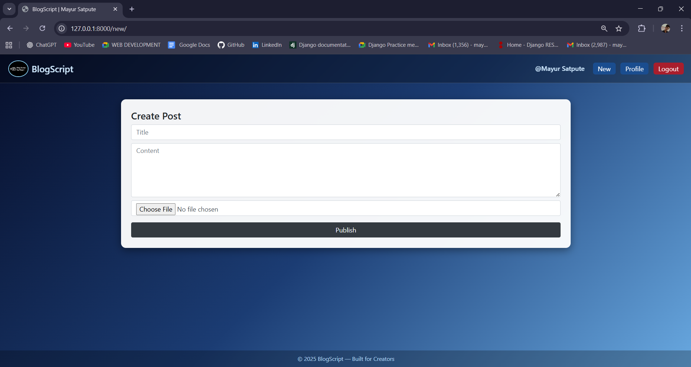

# 📝 BlogScript – A Django Blog Platform

**BlogScript** is a modern, beginner-friendly **Django blog application** that allows users to create, manage, and share blog posts with images.
It includes authentication, profile dashboard, CRUD operations, and a clean Bootstrap-based UI.

> Built with simplicity, scalability, and real-world use in mind.

---

## 🚀 Features

* 🔐 User Authentication (Signup / Login / Logout)
* 🧑‍💻 User Profile Dashboard
* ✍️ Create, Edit & Delete Blog Posts
* 🖼 Image Upload Support
* 🔍 Search Blogs by Title
* 🗂 View All Posts & Personal Posts
* 📱 Responsive UI using Bootstrap
* 📸 Screenshots Included
* 🧾 Clean Git History for Learning

---

## 🛠 Tech Stack

* **Backend:** Django (Python)
* **Frontend:** HTML, Bootstrap 4
* **Database:** SQLite
* **Authentication:** Django Auth
* **Version Control:** Git & GitHub

---

## 📸 Screenshots

### 🏠 Home Page



### 👤 Profile & My Posts



### ✍️ Create New Post



---

## 📂 Project Structure

```text
BlogScript-Django/
│
├── blogapp/
│   ├── models.py
│   ├── views.py
│   ├── urls.py
│
├── templates/
│   ├── base.html
│   ├── home.html
│   ├── profile.html
│   ├── newpost.html
│   ├── blog_detail.html
│
├── static/
│   └── image/
│
├── screenshots/
│   ├── home.png
│   ├── profile.png
│   ├── newpost.png
│
├── manage.py
├── README.md
```

---

## ⚙️ Installation & Setup

Follow these steps to run locally:

```bash
# Clone repository
git clone https://github.com/Mayur-Satpute/BlogScript-Django.git

# Go into project folder
cd BlogScript-Django

# Create virtual environment
python -m venv venv

# Activate venv (Windows)
venv\Scripts\activate

# Install dependencies
pip install django

# Run migrations
python manage.py migrate

# Start server
python manage.py runserver
```

Now open:
👉 **[http://127.0.0.1:8000](http://127.0.0.1:8000)**

---

## 🔐 Authentication Flow

* New users can **Sign Up**
* Existing users can **Login**
* Logged-in users can:

  * Create posts
  * Manage their posts
  * View profile
  * Logout securely

---

## 🧠 Learning Outcomes

This project helps you learn:

* Django authentication
* Media file handling
* CRUD operations
* Template inheritance
* Git & GitHub workflow
* Clean UI design principles

---

## 📈 GitHub Activity Strategy

Every improvement is committed properly so that:

* GitHub contribution graph stays active
* Commit history reflects real development
* Recruiters can track progress

---

## 👨‍💻 Author

**Mayur Satpute**
Aspiring Python Full-Stack Developer
Passionate about building real-world applications 🚀

🔗 GitHub: [https://github.com/Mayur-Satpute](https://github.com/Mayur-Satpute)

---

## 📄 License

This project is licensed under the **MIT License**.
Feel free to use, learn, and improve it.

---

### ⭐ If you like this project

Give it a **star ⭐ on GitHub** — it helps a lot!

---
